# `Target`: Tools to Modularize iOS Project (1)

## Build module using `Target`

`Targets` are usually used for different distributions of the same project. For example, if you want to ship a iPad version, using `Target` could help you a lot. You might also see the `Test Target` in your project if you do Unit Test or UI Test. Anyway, in my perspective, `Targets` are the different managers of all the shared source code in that they determine which files to compile, how to compile and what thing to ship out, etc.

Therefore, to modularize our project, we could ship different modules via `Targets` and let `Main Target` depend on those targets to build up the whole project.

## Setup the environment
The following setup happens in a `workspace` built by CocoaPods, however, it really doesn't matter. You can still build your own target in a `project` following the same procedure.  

1.	Tap `+` button  in `Targets`

	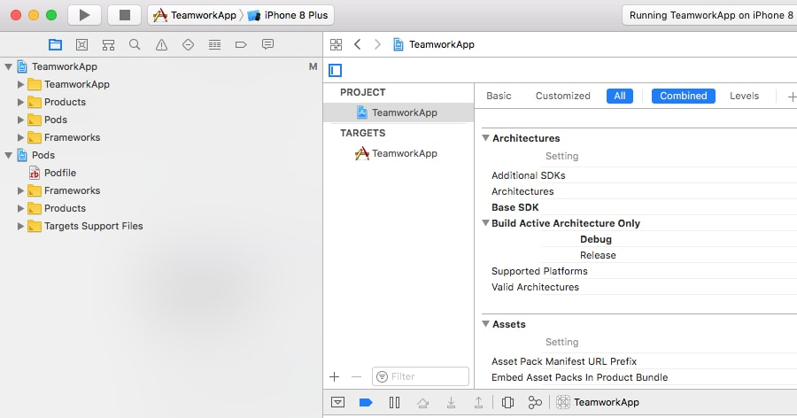

2. Choose `Cocoa Touch Framework` in the poped window.

	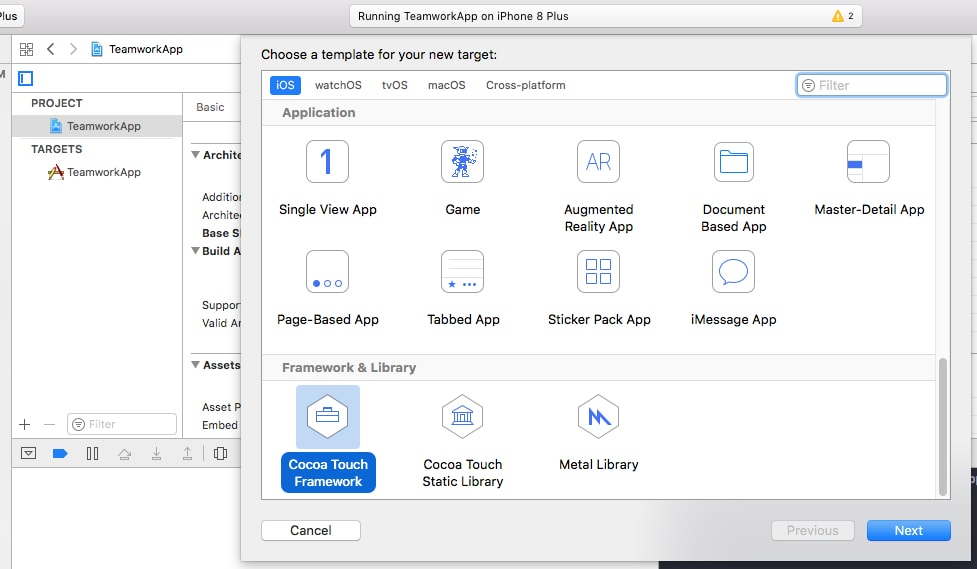

3. Make sure `Project` and `Embed in Application` both targeted at your main Target.

	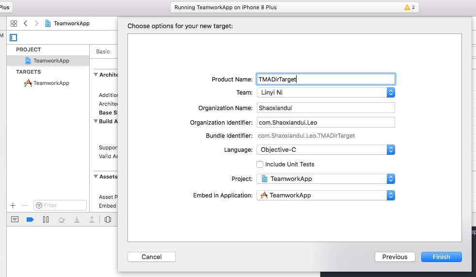

4. You could see that a new folder is created and a new target is added in the `TARGETS` section.

	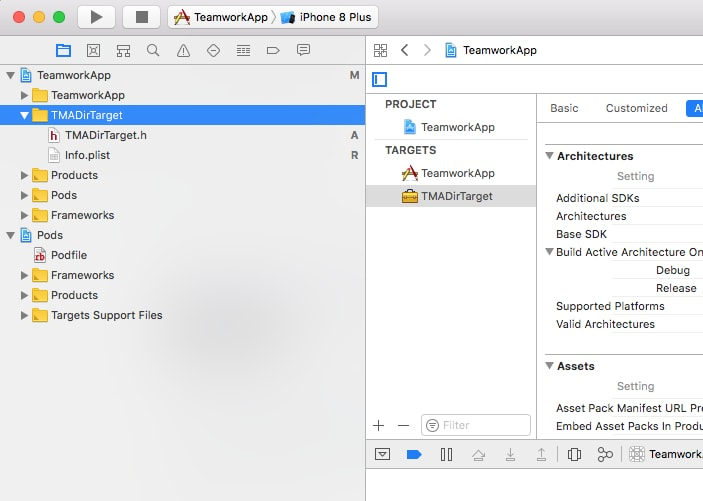

5. In your main target, check if the `Target Dependencies` is set up correctly. If you created multiple targets and wanted to manage dependencies among them, this will be the right place for you.

	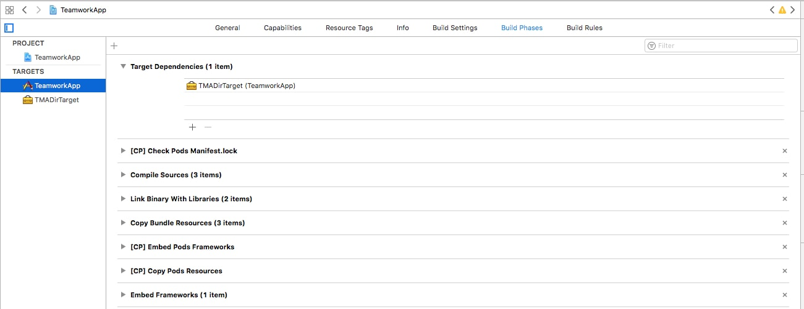

6. Now you can start writing code inside this target. For example, you created a class named `TMADirDemoViewController` and some private helper classes named `TMALittleSecret` and `TMAReallySecret`.

	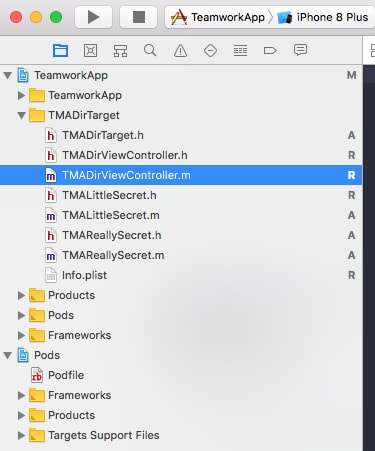

7. In the meantime, you want only `TMADirDemoViewController` to be exposed to the clients (public). Here are what you should do:
    - Move `TMADirViewController.h` to `Public Headers` in `Build Phases`
    - Import `TMADirViewController.h` in header `TMADirTarget.h`

    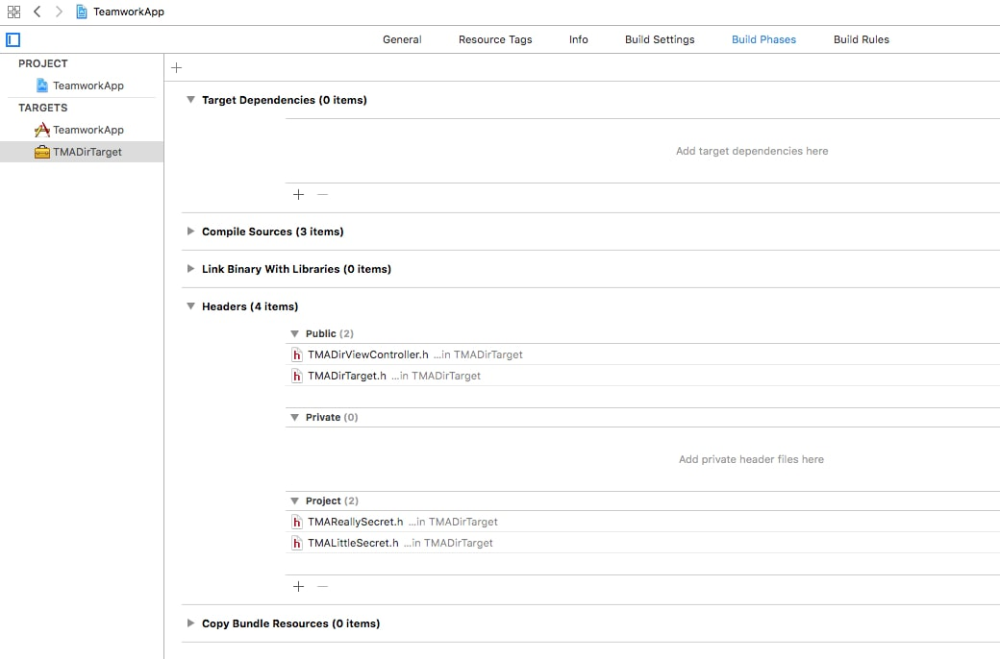
    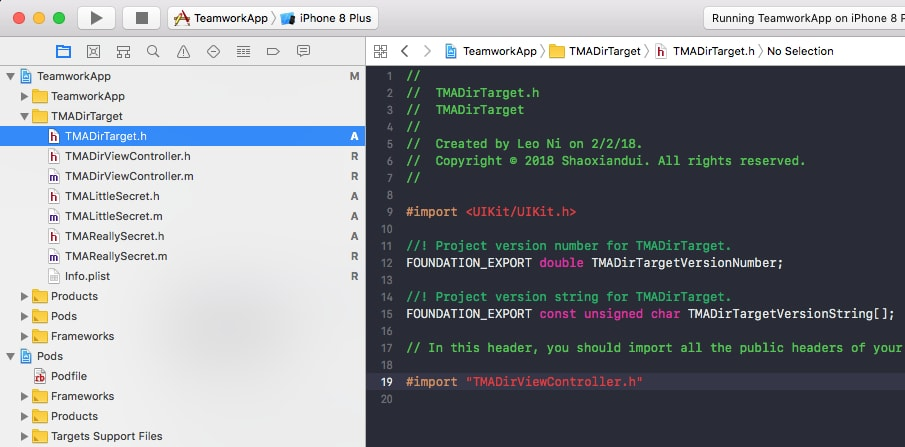

    You might have noticed that we could choose three levels of headers, `Public`,  `Private` and `Project`. And yes, they could control what will be exposed outside the library. (Remember what we build is a Cocoa Touch Library, right?)

    - `Public` means that these interfaces are **exposed** for clients to use and will not change frequently.
    - `Private` **still means these interfaces are exposed**, however, it means for clients to JUST see them rather than use them because these interfaces might be under development that will be changed frequently or other whatever reasons.
    - `Project` means they will **not be exposed**. These interfaces could only be used inside this library(target).

## How do client uses this?
Import this module the same as you did for other libraries
```objc
#import <TMADirTarget/TMADirTarget.h>
```
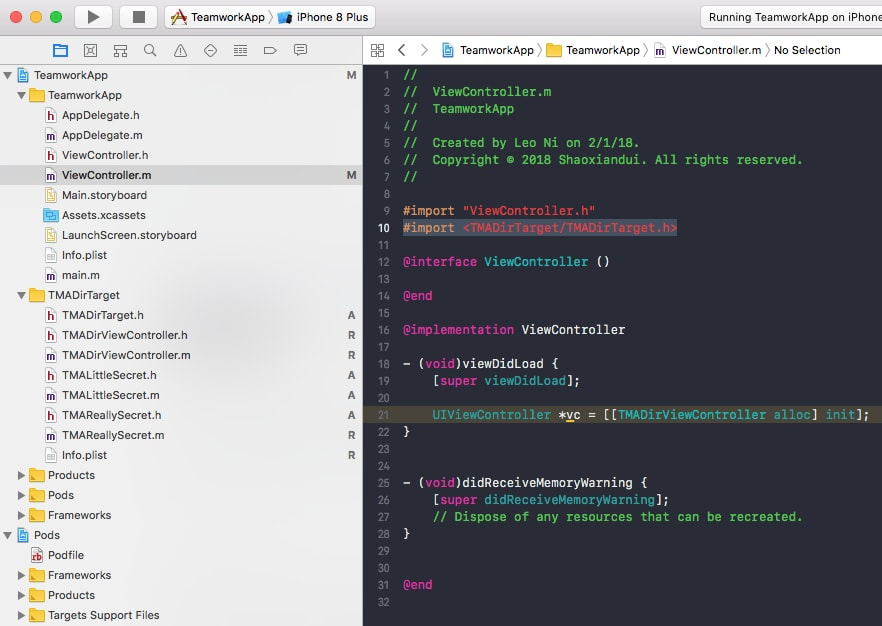

## How to compile and test it separately?
For compile, just change the `Scheme` and then compile.  
For test, however, you will need another target to test this target. But an easier way is that you could select `Unit Test` when you created the target.

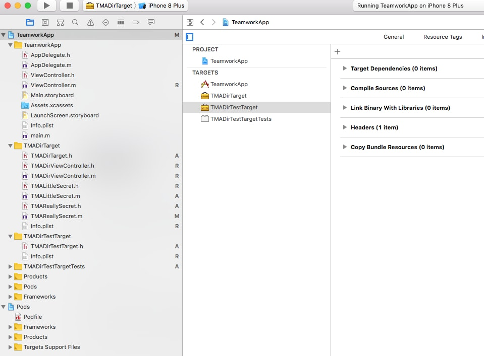

## Working with CocoaPods
If you want this new target to use some Cocoapods libraries, you can just set it in the `Podfile`.

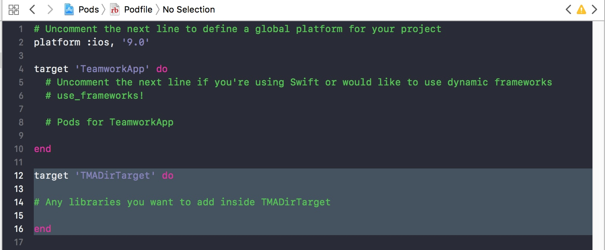
