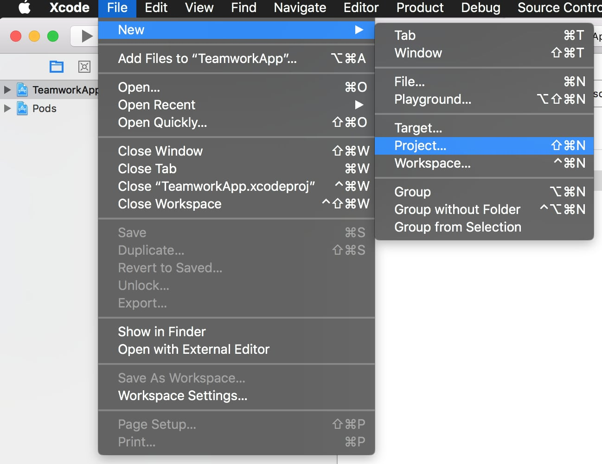
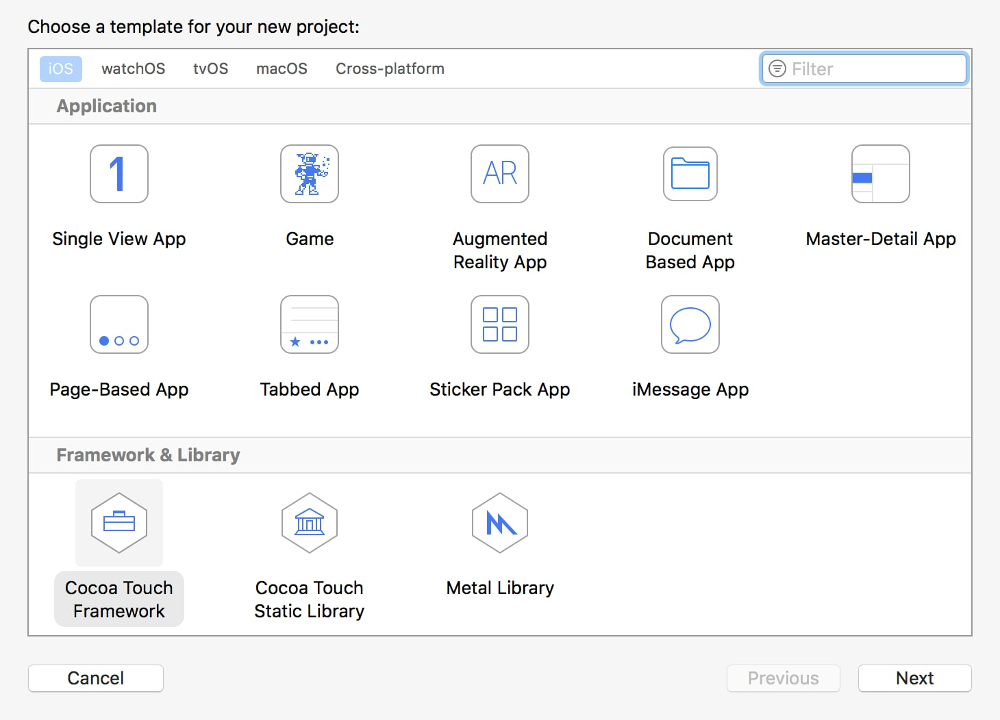
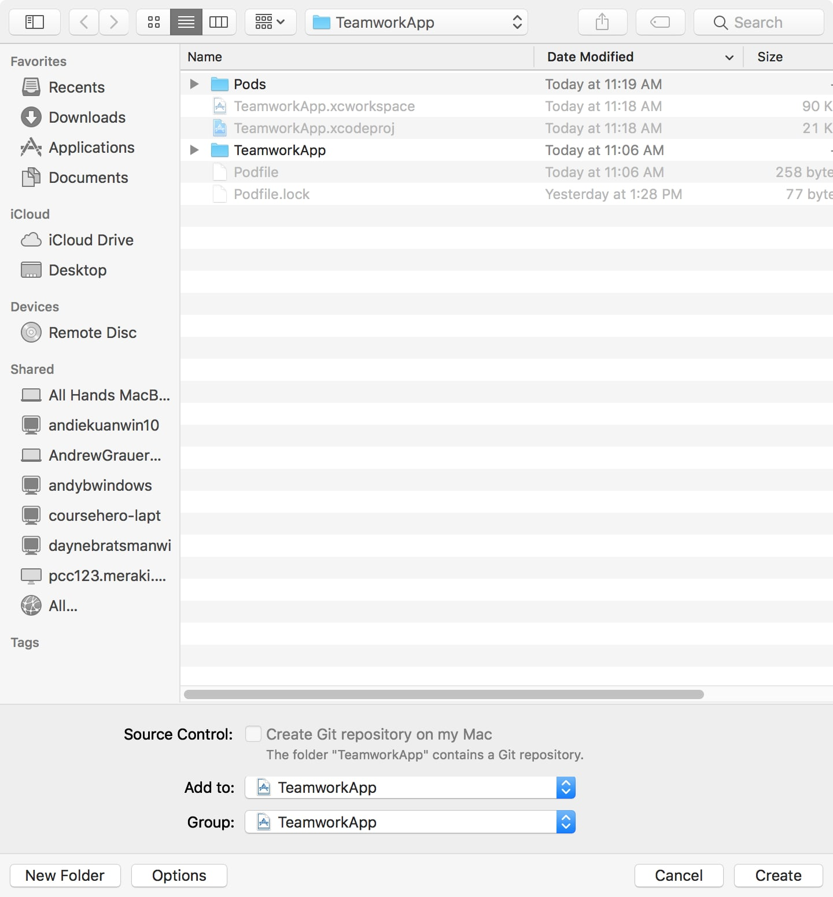
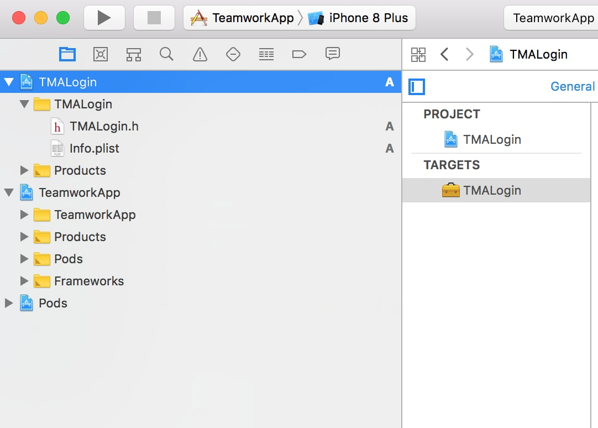
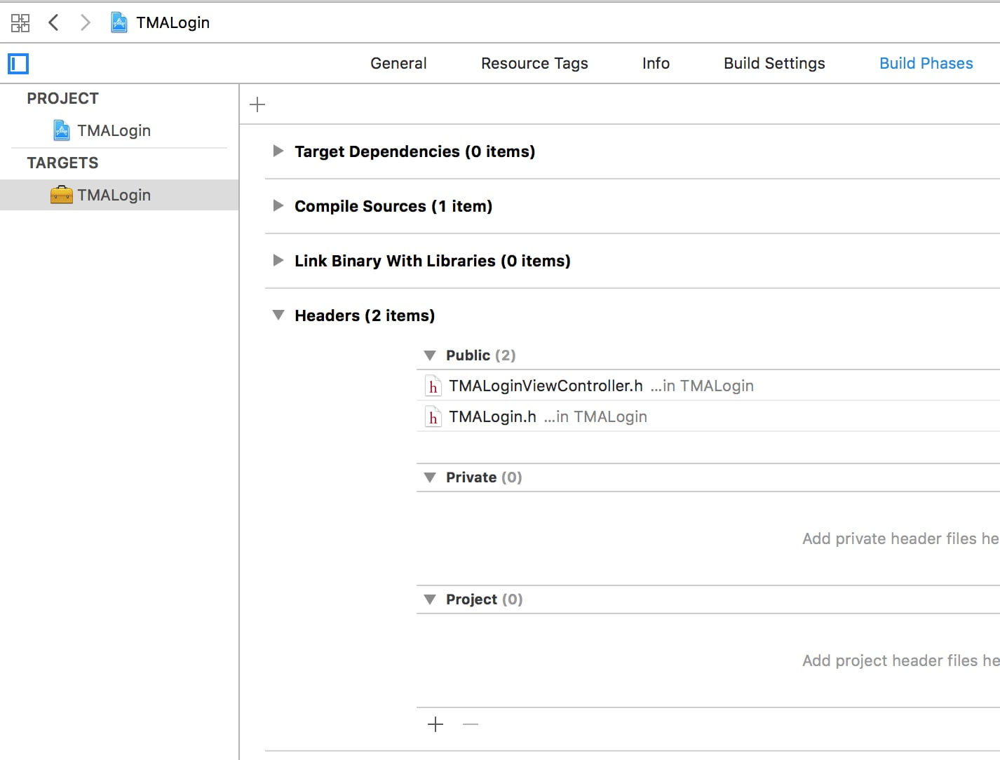
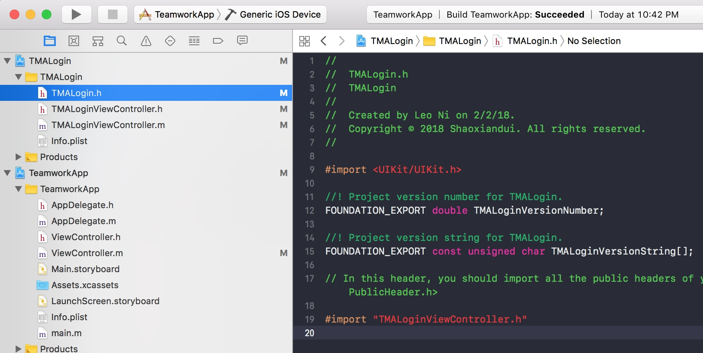
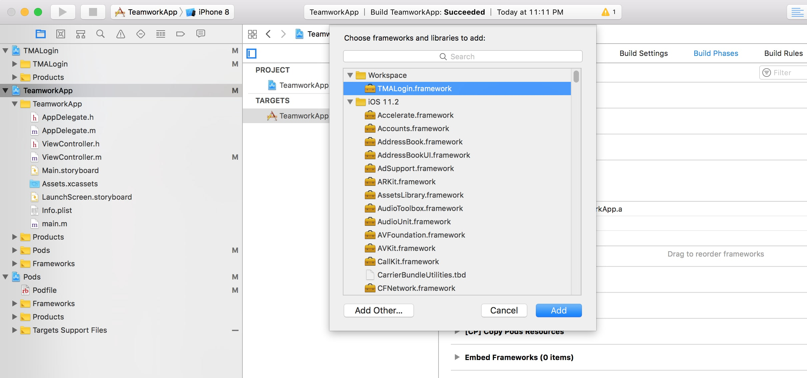
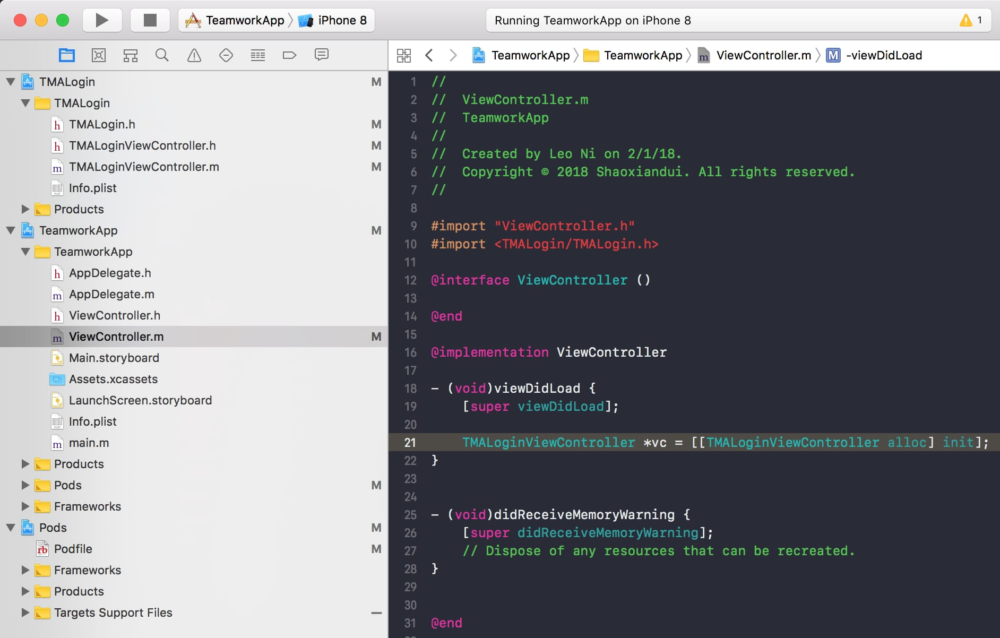
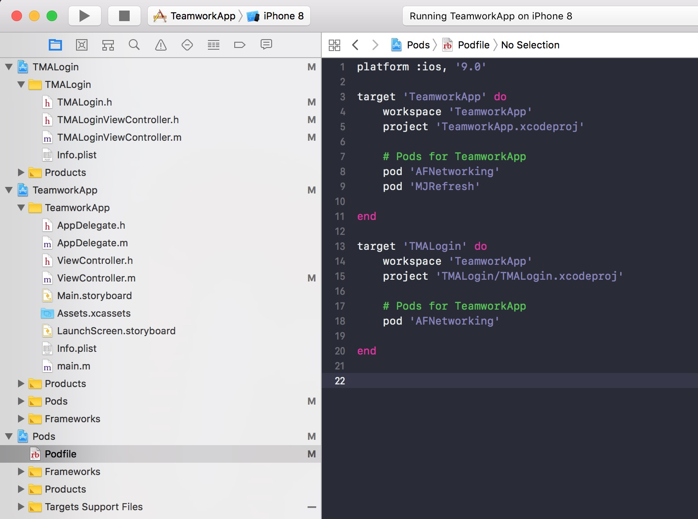

# `Multi-projects`: Tools to Modularize iOS Project (2)

## Build module via `Multi-projects`
The last article was talking about how to use `Target` to build modules. However, if you have multiple teams contributing to different businesses/features, using `Target` to build module might not be suitable. The reason is obvious. Since each `Target` is a folder, each team needs to work in a giant project together because a folder cannot survive/compile without this giant project environment.

`Multi-projects` solves this problem. Each team could work individually on each single `project` without touching the central workspace.

## Setup the environment
In this section, I will use a `workspace` which is generated by CocoaPods and add multiple `projects` into it. If you don't want to use CocoaPods, you can just create an empty `workspace` and then the rest of the procedure remains the same, except that you'll need a main project to literally run the app.

1. Create a project from 'File->Project' and choose 'Cocoa Touch Framework'.

  
  

2. Very important! You should ensure that you are adding it to the correct `workspace` and `group` at this stage. If you want to move `project` into a different folder later, it would be kinda tricky because you need to fix the path (if you just drag a `project` to a different folder). So it’s better to add it to the right place from the start. Normally, we’ll put all `projects` to be in the same level, which means, **`Add to` and `Group`  should both point to `workspace`**.

  


3. As you could see, a new project is added in the same level as the main project `TeamworkApp` is in. Now, you could start working on this single project without the `workspace` environment! (Just open the `TMALogin.xcodeproj` directly).

  

4. Since this project you build is actually a framework, as I said in the first article, you need to appoint which files to be exposed to the client(other team). So, it still needs two steps.
    - Move `TMALoginViewController.h` to `Public Headers` in `Build Phases`
    - Import `TMALoginViewController.h` in header `TMALogin.h`

  
  


  As for what is `Public`, `Project` and `Private` level, I’ll just copy and paste from my the last article.
  - `Public` means that these interfaces are **exposed** for clients to use and will not change frequently.
  - `Private` **still means these interfaces are exposed**, however, it means for clients to JUST see them rather than use them because these interfaces might be under development that will be changed frequently or other whatever reasons.
  - `Project` means they will **not be exposed**. These interfaces could only be used inside this library(target).

## How to use this module in other modules?
At this point, this newly added project will generate a framework when it’s compiled. **However, your other projects have not linked with/depended on this framework automatically**. An extra setup is necessary to let your main project compile successfully. Go to `Link Binary with Libraries` in `Build Phases` in the project that needs this framework, for instance, your main project, and add it.

  

From now and then, the project that linked this framework could be able to see it. For example, I linked `TMALogin` framework in main project `TeamworkApp` and hence I could import it and use it like the picture below.

  

## How to compile and test it separately?
You can compile/test it individually inside each project, or just

## Working with CocoaPods
Just set up the `Podfile` and run `pod install`. Be careful that you need to set the field workspace exactly as your main project's name, otherwise CocoaPods will generate a different workspace for you. And yes, although it looks weird, target filed should be outermost. The picture below says everything.

  

## Pros and Cons
